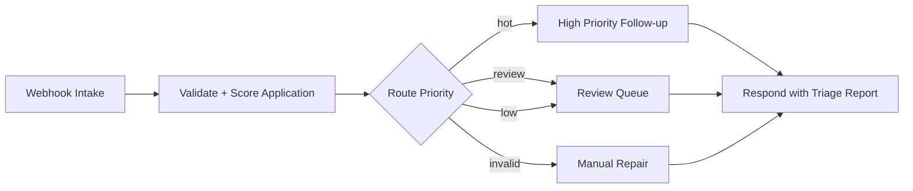

# AutoApplyOps: n8n Internship Application Triage

AutoApplyOps is a portfolio-ready n8n workflow that turns an incoming internship application payload into a validated, scored, routed, and documented follow-up workflow.


## Project Ideas Considered

1. **AutoApplyOps: Internship Application Triage + Follow-up Bot** - webhook intake, validation, scoring, routing, sanitized report, and follow-up draft. This is the implemented project.
2. **IncidentPulse: Website Monitor to Incident Brief** - scheduled checks, severity routing, and incident summary.
3. **ContentPilot: Repurposing Workflow** - submit a transcript or URL and generate platform-specific content drafts.
4. **InvoiceFlow: Receipt Intake Triage** - validate invoice payloads, classify expense category, and route for approval.

## Why AutoApplyOps

Job-search and internship pipelines get messy quickly: data arrives from different sources, deadlines change, and follow-up writing becomes repetitive. This workflow demonstrates practical automation skills without requiring private production credentials.

The project shows:

- Webhook intake and response handling.
- Schema validation and graceful invalid-payload handling.
- Transparent scoring logic.
- Conditional routing for hot, review, low, and invalid applications.
- Privacy-aware sanitized reporting.
- Ready-to-edit follow-up drafts.
- Local tests, screenshot generation, and a short demo video.

## Demo

- [Demo video](docs/assets/autoapplyops-demo.mp4)
- [Dashboard screenshot](docs/assets/demo-dashboard.png)
- [Review queue screenshot](docs/assets/demo-review-queue.png)
- [Invalid payload screenshot](docs/assets/demo-invalid-payload.png)
- [Mobile screenshot](docs/assets/demo-mobile.png)

## Workflow Overview



## Repository Structure

```text
.
├── demo/                         # Local browser demo dashboard
├── docs/                         # Project brief, demo script, import/security docs
├── docs/assets/                  # Screenshots, concept image, and MP4 demo
├── samples/                      # Sanitized payload fixtures
├── scripts/                      # Workflow generation, validation, media capture
├── src/scoring.mjs               # Shared scoring and sanitization logic
├── tests/scoring.test.mjs        # Node test coverage
└── workflows/autoapplyops-intake.json
```

## Quick Start

```bash
npm install
npm run verify
npm run serve
```

Open `http://127.0.0.1:4173/demo/` and switch between the hot lead, review queue, and invalid payload examples.

## Import Into n8n

n8n saves workflows as JSON and supports importing workflow JSON files from the UI or CLI. See the official n8n workflow export/import docs: [docs.n8n.io/workflows/export-import](https://docs.n8n.io/workflows/export-import/).

UI import:

1. Open n8n.
2. Create or open a workflow.
3. Use the workflow menu and choose **Import from File**.
4. Select `workflows/autoapplyops-intake.json`.
5. Test with a sample file from `samples/`.

CLI import:

```bash
n8n import:workflow --input=workflows/autoapplyops-intake.json
```

n8n CLI docs note that imported workflows are deactivated by default, which is the safest state for a shared portfolio project: [docs.n8n.io/hosting/cli-commands](https://docs.n8n.io/hosting/cli-commands/).

## Test Payload

```bash
curl -X POST "$N8N_WEBHOOK_URL" \
  -H "Content-Type: application/json" \
  --data @samples/high-priority-application.json
```

Expected result:

- `validationStatus`: `valid`
- `priority`: `hot`
- `route`: `High Priority Follow-up`
- `followUpDraft`: generated message text
- `sanitizedPayload`: initials and email domain only, not raw personal data

## Security Notes

- The exported workflow contains no credentials.
- The workflow is inactive by default.
- Logs use sanitized payload fields.
- Do not commit `.env`, n8n credential exports, raw webhook headers, execution dumps, or real applicant data.
- For public production webhooks, add a shared secret or signature validation before accepting events.
- n8n production webhook behavior depends on publishing/activation; see n8n docs on publishing workflows and webhook production URLs: [publish docs](https://docs.n8n.io/workflows/publish/) and [Webhook node docs](https://docs.n8n.io/integrations/builtin/core-nodes/n8n-nodes-base.webhook/).

## Verify

```bash
npm run verify
npm run screenshots
npm run demo:video
```

Verification covers:

- Workflow JSON parses and contains required nodes.
- Obvious secret markers are absent.
- Hot lead, review queue, invalid payload, and sanitized logging tests pass.
- Browser screenshots and MP4 demo render from the actual local dashboard.

## Built With

- n8n workflow JSON
- Node.js 22 test runner
- Playwright for screenshot capture
- FFmpeg for the MP4 demo

## Future Improvements

- Add optional Google Sheets or Airtable append node.
- Add Slack or email notification behind n8n credentials.
- Add HMAC signature validation for public webhooks.
- Store idempotency keys to reject duplicate application events.
- Add a daily digest sub-workflow for queued applications.

GitHub recommends a README explain what the project does, why it is useful, and how people can use it. This repository follows that guidance from [GitHub Docs](https://docs.github.com/en/repositories/managing-your-repositorys-settings-and-features/customizing-your-repository/about-readmes).
