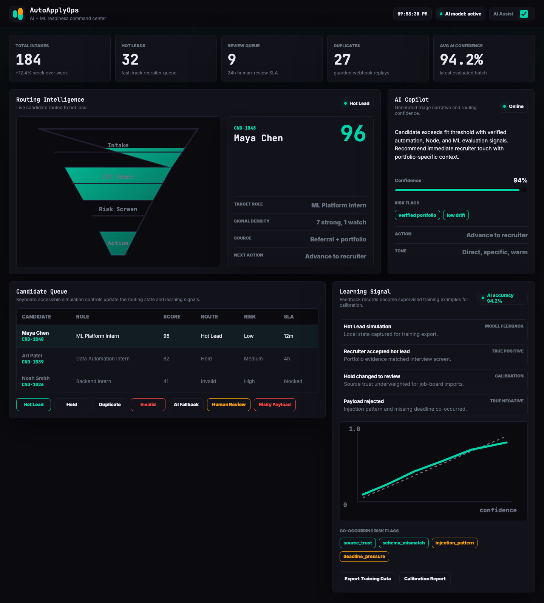
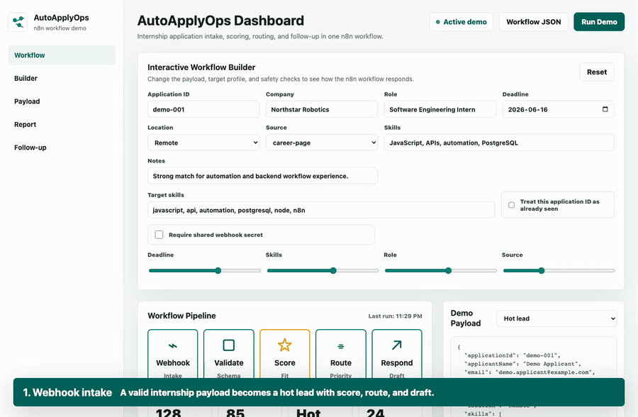
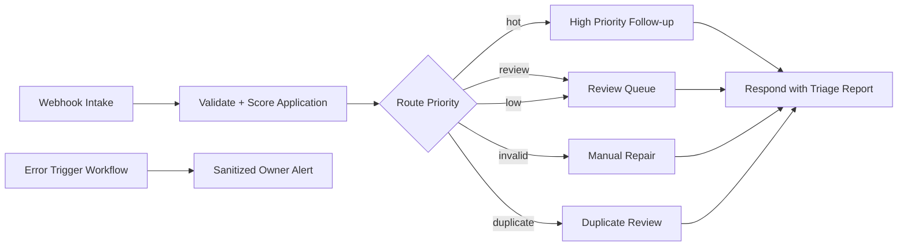

# AutoApplyOps: n8n Internship Application Triage

AutoApplyOps is a portfolio-ready n8n workflow that turns an incoming internship application payload into a validated, scored, routed, duplicate-aware, and documented follow-up workflow.





<video src="docs/assets/autoapplyops-demo.mp4" controls width="100%"></video>

## Project Ideas Considered

1. **AutoApplyOps: Internship Application Triage + Follow-up Bot** - webhook intake, validation, scoring, routing, sanitized report, and follow-up draft. This is the implemented project.
2. **IncidentPulse: Website Monitor to Incident Brief** - scheduled checks, severity routing, and incident summary.
3. **ContentPilot: Repurposing Workflow** - submit a transcript or URL and generate platform-specific content drafts.
4. **InvoiceFlow: Receipt Intake Triage** - validate invoice payloads, classify expense category, and route for approval.

## Why AutoApplyOps

Job-search and internship pipelines get messy quickly: data arrives from different sources, deadlines change, and follow-up writing becomes repetitive. This workflow demonstrates practical automation skills without requiring private production credentials.

The project shows:

- Webhook intake and response handling.
- Schema validation and graceful invalid-payload handling.
- Configurable scoring weights and target skills.
- Conditional routing for hot, review, low, duplicate, and invalid applications.
- Duplicate detection for idempotency-style webhook replays.
- Optional shared-secret validation for safer public webhook use.
- Optional local Ollama AI Copilot with deterministic fallback.
- SQLite-backed feedback collection for future ML calibration.
- Dedicated n8n error-handler workflow with sanitized owner-alert payloads.
- Decision matrix output that explains each score contribution.
- Automation hints for the next action, SLA, notification channel, and retryability.
- Privacy-aware sanitized reporting.
- Formal intake JSON schema, simulation report, and workflow scorecard.
- Ready-to-edit follow-up drafts.
- Interactive local demo, screenshots, GIF preview, and MP4 demo video.

## Demo

- [Demo video](docs/assets/autoapplyops-demo.mp4)
- [Animated GIF preview](docs/assets/autoapplyops-demo.gif)
- [Dashboard screenshot](docs/assets/demo-dashboard.png)
- [Review queue screenshot](docs/assets/demo-review-queue.png)
- [Invalid payload screenshot](docs/assets/demo-invalid-payload.png)
- [Mobile screenshot](docs/assets/demo-mobile.png)

## Workflow Overview



## AI Layer

The AI Copilot layer is optional and credential-free. It calls local Ollama at `http://localhost:11434` with `gemma3:4b` by default, validates the complete response against `schemas/autoapplyops-ai-evaluation.schema.json`, and falls back to `rules-engine/v1` whenever Ollama is unavailable, slow, malformed, or disabled.

One-command Ollama setup:

```bash
ollama pull gemma3:4b
```

Human review is triggered when AI confidence is below `0.55`, when the AI recommends `escalate_to_human`, or when any risk flag is high severity. The dashboard surfaces the 24h human-review SLA and shows fallback/disabled states without requiring Ollama to be running.

## Repository Structure

```text
.
├── demo/                         # Local browser demo dashboard
├── data/                         # Tracked directory; runtime DB/export files are gitignored
├── docs/                         # Project brief, demo script, import/security docs
├── docs/reports/                 # Generated simulation and scorecard reports
├── schemas/                      # Intake, AI evaluation, and feedback contracts
├── docs/assets/                  # Screenshots, concept image, and MP4 demo
├── samples/                      # Sanitized payload fixtures
├── scripts/                      # Workflow generation, validation, media capture
├── lib/                          # AI evaluator and feedback store modules
├── src/scoring.mjs               # Shared scoring and sanitization logic
├── tests/                        # Node test coverage
└── workflows/                    # Frozen intake, main, AI Copilot, and error-handler n8n workflows
```

`workflows/autoapplyops-intake.json` is frozen for backwards compatibility. New deterministic updates live in `workflows/autoapplyops-main.json`, and optional AI enrichment lives in `workflows/autoapplyops-ai-copilot.json`.

## Prerequisites

- Node.js 20+
- Ollama, optional for the AI layer
- node-gyp build tools for feedback persistence through `better-sqlite3`
- Python 3, required by node-gyp on some systems

Platform build-tool setup:

```bash
# macOS
xcode-select --install

# Ubuntu
sudo apt-get install build-essential

# Windows
npm install --global windows-build-tools
```

## Quick Start

```bash
npm install
npm run verify
npm run serve
```

Open `http://127.0.0.1:4173/demo/` and use the simulation controls to test hot leads, hold routing, duplicates, invalid payloads, AI fallback, human review, risky payloads, and the Learning Signal panel.

## Import Into n8n

n8n saves workflows as JSON and supports importing workflow JSON files from the UI or CLI. See the official n8n workflow export/import docs: [docs.n8n.io/workflows/export-import](https://docs.n8n.io/workflows/export-import/).

UI import:

1. Open n8n.
2. Create or open a workflow.
3. Use the workflow menu and choose **Import from File**.
4. Select `workflows/autoapplyops-intake.json`.
5. Import `workflows/autoapplyops-error-handler.json`.
6. In the main workflow settings, set the error workflow to **AutoApplyOps - Error Handler**.
7. Test with a sample file from `samples/`.

CLI import:

```bash
n8n import:workflow --input=workflows/autoapplyops-intake.json
n8n import:workflow --input=workflows/autoapplyops-main.json
n8n import:workflow --input=workflows/autoapplyops-ai-copilot.json
n8n import:workflow --input=workflows/autoapplyops-error-handler.json
```

n8n CLI docs note that imported workflows are deactivated by default, which is the safest state for a shared portfolio project: [docs.n8n.io/hosting/cli-commands](https://docs.n8n.io/hosting/cli-commands/).

## Test Payload

```bash
curl -X POST "$N8N_WEBHOOK_URL" \
  -H "Content-Type: application/json" \
  --data @samples/high-priority-application.json
```

Expected result:

- `validationStatus`: `valid`
- `priority`: `hot`
- `route`: `High Priority Follow-up`
- `followUpDraft`: generated message text
- `decisionMatrix`: point-by-point scoring explanation
- `automationHints`: next step, SLA, notification route, and retryability
- `sanitizedPayload`: initials and email domain only, not raw personal data

Optional runtime config can be sent with the payload:

```json
{
  "config": {
    "targetSkills": ["javascript", "api", "automation", "n8n"],
    "weights": {
      "deadline": 20,
      "skills": 40,
      "role": 20,
      "location": 10,
      "completeness": 5,
      "source": 5
    },
    "knownApplicationIds": ["demo-001"],
    "requireSharedSecret": true,
    "expectedSharedSecret": "replace-in-production"
  }
}
```

## Security Notes

- The exported workflow contains no credentials.
- The workflow is inactive by default.
- Logs use sanitized payload fields.
- Optional shared-secret checking is supported through payload config or `AUTOAPPLYOPS_WEBHOOK_SECRET`.
- Duplicate IDs can route to `Duplicate Review` instead of creating repeated follow-ups.
- Do not commit `.env`, n8n credential exports, raw webhook headers, execution dumps, or real applicant data.
- For public production webhooks, add a shared secret or signature validation before accepting events.
- n8n production webhook behavior depends on publishing/activation; see n8n docs on publishing workflows and webhook production URLs: [publish docs](https://docs.n8n.io/workflows/publish/) and [Webhook node docs](https://docs.n8n.io/integrations/builtin/core-nodes/n8n-nodes-base.webhook/).

## Verify

```bash
npm run verify
npm run screenshots
npm run demo:video
```

Verification covers:

- Workflow JSON parses and contains required nodes.
- Main workflow and error-handler workflow are both importable.
- Obvious secret markers are absent.
- Hot lead, review queue, duplicate, invalid secret, invalid payload, scoring-tuning, and sanitized logging tests pass.
- Sample simulation report is generated.
- Workflow scorecard reaches `100/100`.
- ML readiness check validates feedback schema, SQLite migrations, append-only trigger, calibration export, and training data shape.
- Browser screenshots, GIF preview, and MP4 demo render from the actual local dashboard.

## Built With

- n8n workflow JSON
- Node.js 22 test runner
- Playwright for screenshot capture
- FFmpeg for the MP4 and GIF demo

## Future Improvements

- Add optional Google Sheets or Airtable append node.
- Add Slack or email notification behind n8n credentials.
- Replace simple shared-secret checking with signed HMAC validation for public webhooks.
- Store idempotency keys in Redis, Postgres, Airtable, or n8n Data Tables.
- Add a daily digest sub-workflow for queued applications.

## Reports

- [Sample simulation](docs/reports/sample-simulation.md)
- [Workflow scorecard](docs/reports/workflow-scorecard.md)
- [Research and recommendations](docs/research-and-recommendations.md)
- [Operations runbook](docs/operations.md)
- [AI architecture](docs/ai-architecture.md)
- [Feedback store](docs/feedback-store.md)
- [ML roadmap](docs/ml-roadmap.md)

GitHub recommends a README explain what the project does, why it is useful, and how people can use it. This repository follows that guidance from [GitHub Docs](https://docs.github.com/en/repositories/managing-your-repositorys-settings-and-features/customizing-your-repository/about-readmes).
